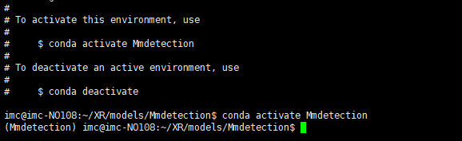
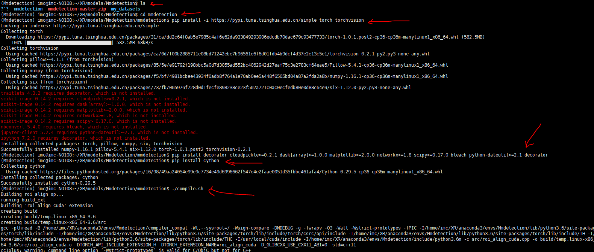
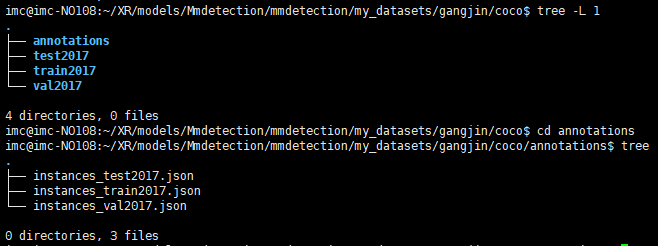
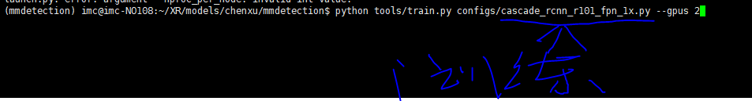
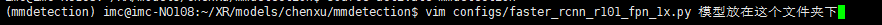
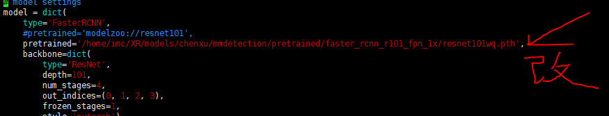
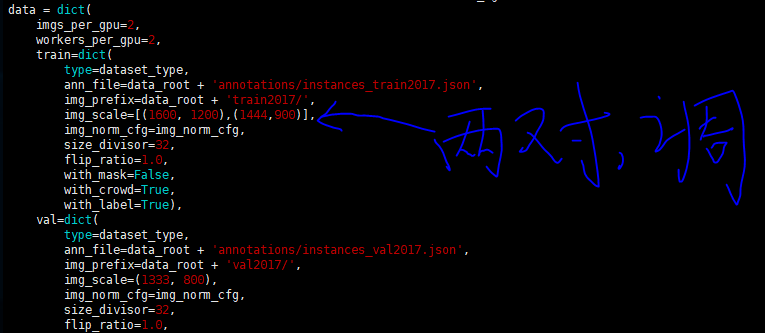
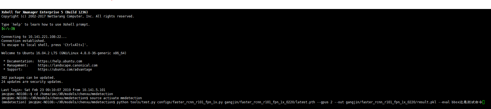
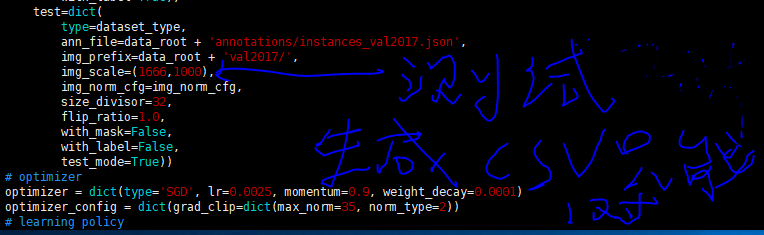
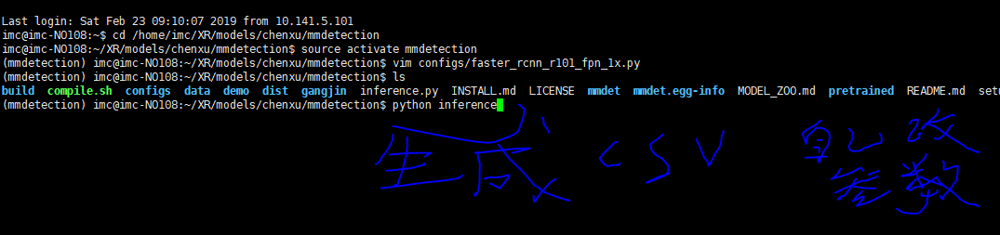

Not so much nonsense, follow my steps

- ## install mmdetection

  Create a virtual environment and operate in a virtual environment

  ```
  conda create -n Mmdetection python=3.6
  conda activate Mmdetection
  ```

  

  Install some necessary packages

```
unzip mmdetection-master.zip #I have downloaded it in advance, directly extract it.
cd mmdetection
pip install -i https://pypi.tuna.tsinghua.edu.cn/simple torch torchvision #Install pytorch through Tsinghua source
pip install decorator cloudpickle>=0.2.1 dask[array]>=1.0.0 matplotlib>=2.0.0 networkx>=1.8 scipy>=0.17.0 bleach python-dateutil>=2.1 decorator #Install these required packages according to the red code hints
pip install cython
./compile.sh  #These two lines of code, install cython
python setup.py install #Install mmdetection
```



- ## Making our own datasets:  Coco format

  annotations----------Store the .json files

  The other three folders store test sets, training sets, and validation sets.

  

  For information on how to make a coco format dataset, please refer to my three .py files.

```
pascal_voc_xml2json.py

test_coco.py

test_image.py
```

- ## Training

  training code

  ```
  python tools/train.py configs/faster_rcnn_x101_32x4d_fpn_1x.py --gpu 2
  ```

  

Model is placed in the configs folder



There are some parameters in the .py file that need to be changed, you can obviously see that like this



You can fine tune the scale in the train code block to training



- ## Test

Test code

```
python tools/test.py configs/cascade_rcnn_r101_fpn_1x.py gangjin/cascade_rcnn_r101_fpn_1x_0222/latest.pth --gpus 2 --out gangjin/cascade_rcnn_r101_fpn_1x/result.pkl --eval bbox
```



You can fine tune the scale in the test code block to test

```
vim cascade_rcnn_r101_fpn_1x.py
```



There are some parameters in the inference.py file that need to be changed,like threshold



- ## visualization

  refer to my show_bboxes.py file


