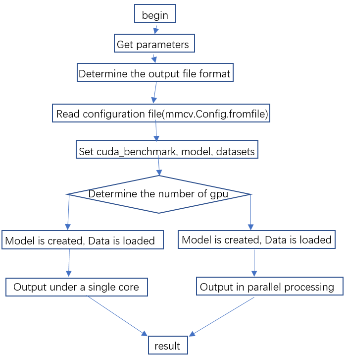
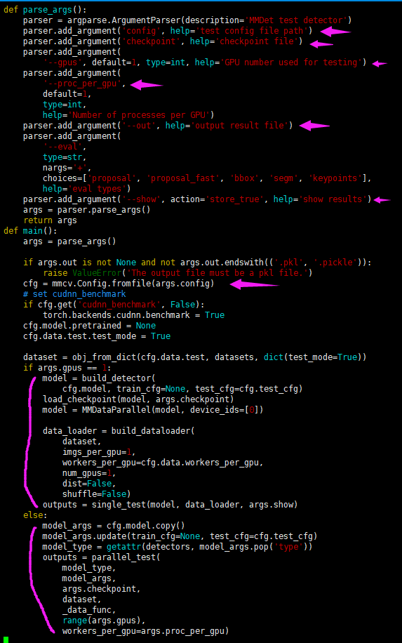
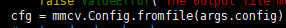
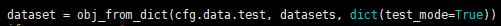
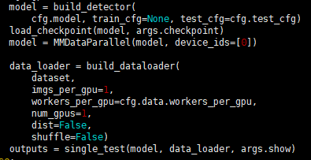
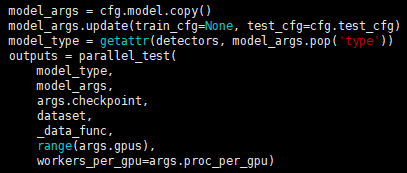

## test.py

------

process:

| parameter name |                      meaning                      |
| :------------: | :-----------------------------------------------: |
|     config     |              Configuration file name              |
|   checkpoint   |                  checkpoint file                  |
|      gpus      |                   Number of gpu                   |
|  proc_per_gpu  | The number of processes per gpu, the default is 1 |
|      out       |                name of output file                |
|      eval      |                Authentication type                |
|      show      |                    show result                    |

Parsing the configuration file:

Load datasets:

Model is created and data is loaded

​    1.Single gpu

2. Multiple gpus

   