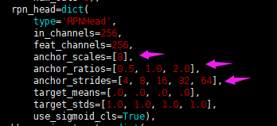
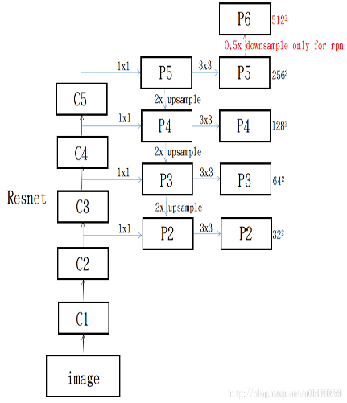

Here I take **fast_rcnn_r50_fpn_1x.py** and **cascade_rcnn_r50_fpn_1x.py** as examples to briefly introduce the meaning of each parameter in mmdetection.

------

**fast_rcnn_r50_fpn_1x.py**

The framework described in this configuration file, which is based on the resnet50 backbone, a fast-RCNN target detection network with five fpn feature layers, and the training iterations are standard 12 epochs.

```
# model settings
model = dict(
	type='FasterRCNN',                         # model类型
    pretrained='modelzoo://resnet50',          # 预训练模型：imagenet-resnet50
    backbone=dict(
        type='ResNet',                         # backbone类型
        depth=50,                              # 网络层数
        num_stages=4,                          # resnet的stage数量
        out_indices=(0, 1, 2, 3),              # 输出的stage的序号
        frozen_stages=1,                       # 冻结的stage数量，即该stage不更新参数，-1表示所有的stage都更新参数
        style='pytorch'),                      # 网络风格：如果设置pytorch，则stride为2的层是conv3x3的卷积层；如果设置caffe，则stride为2的层是第一个conv1x1的卷积层
    neck=dict(
        type='FPN',                            # neck类型
        in_channels=[256, 512, 1024, 2048],    # 输入的各个stage的通道数
        out_channels=256,                      # 输出的特征层的通道数
        num_outs=5),                           # 输出的特征层的数量
    rpn_head=dict(
        type='RPNHead',                        # RPN网络类型
        in_channels=256,                       # RPN网络的输入通道数
        feat_channels=256,                     # 特征层的通道数
        anchor_scales=[8],                     # 生成的anchor的baselen，baselen = sqrt(w*h)，w和h为anchor的宽和高
        anchor_ratios=[0.5, 1.0, 2.0],         # anchor的宽高比
        anchor_strides=[4, 8, 16, 32, 64],     # 在每个特征层上的anchor的步长（对应于原图）
        target_means=[.0, .0, .0, .0],         # 均值
        target_stds=[1.0, 1.0, 1.0, 1.0],      # 方差
        use_sigmoid_cls=True),                 # 是否使用sigmoid来进行分类，如果False则使用softmax来分类
    bbox_roi_extractor=dict(
        type='SingleRoIExtractor',                                   # RoIExtractor类型
        roi_layer=dict(type='RoIAlign', out_size=7, sample_num=2),   # ROI具体参数：ROI类型为ROIalign，输出尺寸为7，sample数为2
        out_channels=256,                                            # 输出通道数
        featmap_strides=[4, 8, 16, 32]),                             # 特征图的步长
    bbox_head=dict(
        type='SharedFCBBoxHead',                     # 全连接层类型
        num_fcs=2,                                   # 全连接层数量
        in_channels=256,                             # 输入通道数
        fc_out_channels=1024,                        # 输出通道数
        roi_feat_size=7,                             # ROI特征层尺寸
        num_classes=81,                              # 分类器的类别数量+1，+1是因为多了一个背景的类别
        target_means=[0., 0., 0., 0.],               # 均值
        target_stds=[0.1, 0.1, 0.2, 0.2],            # 方差
        reg_class_agnostic=False))                   # 是否采用class_agnostic的方式来预测，class_agnostic表示输出bbox时只考虑其是否为前景，后续分类的时候再根据该bbox在网络中的类别得分来分类，也就是说一个框可以对应多个类别
# model training and testing settings
train_cfg = dict(
    rpn=dict(
        assigner=dict(
            type='MaxIoUAssigner',            # RPN网络的正负样本划分
            pos_iou_thr=0.7,                  # 正样本的iou阈值
            neg_iou_thr=0.3,                  # 负样本的iou阈值
            min_pos_iou=0.3,                  # 正样本的iou最小值。如果assign给ground truth的anchors中最大的IOU低于0.3，则忽略所有的anchors，否则保留最大IOU的anchor
            ignore_iof_thr=-1),               # 忽略bbox的阈值，当ground truth中包含需要忽略的bbox时使用，-1表示不忽略
        sampler=dict(
            type='RandomSampler',             # 正负样本提取器类型
            num=256,                          # 需提取的正负样本数量
            pos_fraction=0.5,                 # 正样本比例
            neg_pos_ub=-1,                    # 最大负样本比例，大于该比例的负样本忽略，-1表示不忽略
            add_gt_as_proposals=False),       # 把ground truth加入proposal作为正样本
        allowed_border=0,                     # 允许在bbox周围外扩一定的像素
        pos_weight=-1,                        # 正样本权重，-1表示不改变原始的权重
        smoothl1_beta=1 / 9.0,                # 平滑L1系数
        debug=False),                         # debug模式
    rcnn=dict(
        assigner=dict(
            type='MaxIoUAssigner',            # RCNN网络正负样本划分
            pos_iou_thr=0.5,                  # 正样本的iou阈值
            neg_iou_thr=0.5,                  # 负样本的iou阈值
            min_pos_iou=0.5,                  # 正样本的iou最小值。如果assign给ground truth的anchors中最大的IOU低于0.3，则忽略所有的anchors，否则保留最大IOU的anchor
            ignore_iof_thr=-1),               # 忽略bbox的阈值，当ground truth中包含需要忽略的bbox时使用，-1表示不忽略
        sampler=dict(
            type='RandomSampler',             # 正负样本提取器类型
            num=512,                          # 需提取的正负样本数量
            pos_fraction=0.25,                # 正样本比例
            neg_pos_ub=-1,                    # 最大负样本比例，大于该比例的负样本忽略，-1表示不忽略
            add_gt_as_proposals=True),        # 把ground truth加入proposal作为正样本
        pos_weight=-1,                        # 正样本权重，-1表示不改变原始的权重
        debug=False))                         # debug模式
test_cfg = dict(
    rpn=dict(                                 # 推断时的RPN参数
        nms_across_levels=False,              # 在所有的fpn层内做nms
        nms_pre=2000,                         # 在nms之前保留的的得分最高的proposal数量
        nms_post=2000,                        # 在nms之后保留的的得分最高的proposal数量
        max_num=2000,                         # 在后处理完成之后保留的proposal数量
        nms_thr=0.7,                          # nms阈值
        min_bbox_size=0),                     # 最小bbox尺寸
    rcnn=dict(
        score_thr=0.05, nms=dict(type='nms', iou_thr=0.5), max_per_img=100)   # max_per_img表示最终输出的det bbox数量
    # soft-nms is also supported for rcnn testing
    # e.g., nms=dict(type='soft_nms', iou_thr=0.5, min_score=0.05)            # soft_nms参数
)
# dataset settings
dataset_type = 'CocoDataset'                # 数据集类型
data_root = 'data/coco/'                    # 数据集根目录
img_norm_cfg = dict(
    mean=[123.675, 116.28, 103.53], std=[58.395, 57.12, 57.375], to_rgb=True)   # 输入图像初始化，减去均值mean并处以方差std，to_rgb表示将bgr转为rgb
data = dict(
    imgs_per_gpu=2,                # 每个gpu计算的图像数量
    workers_per_gpu=2,             # 每个gpu分配的线程数
    train=dict(
        type=dataset_type,                                                 # 数据集类型
        ann_file=data_root + 'annotations/instances_train2017.json',       # 数据集annotation路径
        img_prefix=data_root + 'train2017/',                               # 数据集的图片路径
        img_scale=(1333, 800),                                             # 输入图像尺寸，最大边1333，最小边800
        img_norm_cfg=img_norm_cfg,                                         # 图像初始化参数
        size_divisor=32,                                                   # 对图像进行resize时的最小单位，32表示所有的图像都会被resize成32的倍数
        flip_ratio=0.5,                                                    # 图像的随机左右翻转的概率
        with_mask=False,                                                   # 训练时附带mask
        with_crowd=True,                                                   # 训练时附带difficult的样本
        with_label=True),                                                  # 训练时附带label
    val=dict(
        type=dataset_type,                                                 # 同上
        ann_file=data_root + 'annotations/instances_val2017.json',         # 同上
        img_prefix=data_root + 'val2017/',                                 # 同上
        img_scale=(1333, 800),                                             # 同上
        img_norm_cfg=img_norm_cfg,                                         # 同上
        size_divisor=32,                                                   # 同上
        flip_ratio=0,                                                      # 同上
        with_mask=False,                                                   # 同上
        with_crowd=True,                                                   # 同上
        with_label=True),                                                  # 同上
    test=dict(
        type=dataset_type,                                                 # 同上
        ann_file=data_root + 'annotations/instances_val2017.json',         # 同上
        img_prefix=data_root + 'val2017/',                                 # 同上
        img_scale=(1333, 800),                                             # 同上
        img_norm_cfg=img_norm_cfg,                                         # 同上
        size_divisor=32,                                                   # 同上
        flip_ratio=0,                                                      # 同上
        with_mask=False,                                                   # 同上
        with_label=False,                                                  # 同上
        test_mode=True))                                                   # 同上
# optimizer
optimizer = dict(type='SGD', lr=0.02, momentum=0.9, weight_decay=0.0001)   # 优化参数，lr为学习率，momentum为动量因子，weight_decay为权重衰减因子
optimizer_config = dict(grad_clip=dict(max_norm=35, norm_type=2))          # 梯度均衡参数
# learning policy
lr_config = dict(
    policy='step',                        # 优化策略
    warmup='linear',                      # 初始的学习率增加的策略，linear为线性增加
    warmup_iters=500,                     # 在初始的500次迭代中学习率逐渐增加
    warmup_ratio=1.0 / 3,                 # 起始的学习率
    step=[8, 11])                         # 在第8和11个epoch时降低学习率
checkpoint_config = dict(interval=1)      # 每1个epoch存储一次模型
# yapf:disable
log_config = dict(
    interval=50,                          # 每50个batch输出一次信息
    hooks=[
        dict(type='TextLoggerHook'),      # 控制台输出信息的风格
        # dict(type='TensorboardLoggerHook')
    ])
# yapf:enable
# runtime settings
total_epochs = 12                               # 最大epoch数
dist_params = dict(backend='nccl')              # 分布式参数
log_level = 'INFO'                              # 输出信息的完整度级别
work_dir = './work_dirs/faster_rcnn_r50_fpn_1x' # log文件和模型文件存储路径
load_from = None                                # 加载模型的路径，None表示从预训练模型加载
resume_from = None                              # 恢复训练模型的路径
workflow = [('train', 1)]                       # 当前工作区名称
```

## cascade_rcnn_r50_fpn_1x.py

The improvement compared to the faster-RCNN is mainly due to the fact that the RCNN has three stages, and the three stages progressively refine the detection results, resulting in higher precision.

```
# model settings
model = dict(
    type='CascadeRCNN',
    num_stages=3,                     # RCNN网络的stage数量，在faster-RCNN中为1
    pretrained='modelzoo://resnet50',
    backbone=dict(
        type='ResNet',
        depth=50,
        num_stages=4,
        out_indices=(0, 1, 2, 3),
        frozen_stages=1,
        style='pytorch'),
    neck=dict(
        type='FPN',
        in_channels=[256, 512, 1024, 2048],
        out_channels=256,
        num_outs=5),
    rpn_head=dict(
        type='RPNHead',
        in_channels=256,
        feat_channels=256,
        anchor_scales=[8],
        anchor_ratios=[0.5, 1.0, 2.0],
        anchor_strides=[4, 8, 16, 32, 64],
        target_means=[.0, .0, .0, .0],
        target_stds=[1.0, 1.0, 1.0, 1.0],
        use_sigmoid_cls=True),
    bbox_roi_extractor=dict(
        type='SingleRoIExtractor',
        roi_layer=dict(type='RoIAlign', out_size=7, sample_num=2),
        out_channels=256,
        featmap_strides=[4, 8, 16, 32]),
    bbox_head=[
        dict(
            type='SharedFCBBoxHead',
            num_fcs=2,
            in_channels=256,
            fc_out_channels=1024,
            roi_feat_size=7,
            num_classes=81,
            target_means=[0., 0., 0., 0.],
            target_stds=[0.1, 0.1, 0.2, 0.2],
            reg_class_agnostic=True),
        dict(
            type='SharedFCBBoxHead',
            num_fcs=2,
            in_channels=256,
            fc_out_channels=1024,
            roi_feat_size=7,
            num_classes=81,
            target_means=[0., 0., 0., 0.],
            target_stds=[0.05, 0.05, 0.1, 0.1],
            reg_class_agnostic=True),
        dict(
            type='SharedFCBBoxHead',
            num_fcs=2,
            in_channels=256,
            fc_out_channels=1024,
            roi_feat_size=7,
            num_classes=81,
            target_means=[0., 0., 0., 0.],
            target_stds=[0.033, 0.033, 0.067, 0.067],
            reg_class_agnostic=True)
    ])
# model training and testing settings
train_cfg = dict(
    rpn=dict(
        assigner=dict(
            type='MaxIoUAssigner',
            pos_iou_thr=0.7,
            neg_iou_thr=0.3,
            min_pos_iou=0.3,
            ignore_iof_thr=-1),
        sampler=dict(
            type='RandomSampler',
            num=256,
            pos_fraction=0.5,
            neg_pos_ub=-1,
            add_gt_as_proposals=False),
        allowed_border=0,
        pos_weight=-1,
        smoothl1_beta=1 / 9.0,
        debug=False),
    rcnn=[                    # 注意，这里有3个RCNN的模块，对应开头的那个RCNN的stage数量
        dict(
            assigner=dict(
                type='MaxIoUAssigner',
                pos_iou_thr=0.5,
                neg_iou_thr=0.5,
                min_pos_iou=0.5,
                ignore_iof_thr=-1),
            sampler=dict(
                type='RandomSampler',
                num=512,
                pos_fraction=0.25,
                neg_pos_ub=-1,
                add_gt_as_proposals=True),
            pos_weight=-1,
            debug=False),
        dict(
            assigner=dict(
                type='MaxIoUAssigner',
                pos_iou_thr=0.6,
                neg_iou_thr=0.6,
                min_pos_iou=0.6,
                ignore_iof_thr=-1),
            sampler=dict(
                type='RandomSampler',
                num=512,
                pos_fraction=0.25,
                neg_pos_ub=-1,
                add_gt_as_proposals=True),
            pos_weight=-1,
            debug=False),
        dict(
            assigner=dict(
                type='MaxIoUAssigner',
                pos_iou_thr=0.7,
                neg_iou_thr=0.7,
                min_pos_iou=0.7,
                ignore_iof_thr=-1),
            sampler=dict(
                type='RandomSampler',
                num=512,
                pos_fraction=0.25,
                neg_pos_ub=-1,
                add_gt_as_proposals=True),
            pos_weight=-1,
            debug=False)
    ],
    stage_loss_weights=[1, 0.5, 0.25])     # 3个RCNN的stage的loss权重
test_cfg = dict(
    rpn=dict(
        nms_across_levels=False,
        nms_pre=2000,
        nms_post=2000,
        max_num=2000,
        nms_thr=0.7,
        min_bbox_size=0),
    rcnn=dict(
        score_thr=0.05, nms=dict(type='nms', iou_thr=0.5), max_per_img=100),
    keep_all_stages=False)         # 是否保留所有stage的结果
# dataset settings
dataset_type = 'CocoDataset'
data_root = 'data/coco/'
img_norm_cfg = dict(
    mean=[123.675, 116.28, 103.53], std=[58.395, 57.12, 57.375], to_rgb=True)
data = dict(
    imgs_per_gpu=2,
    workers_per_gpu=2,
    train=dict(
        type=dataset_type,
        ann_file=data_root + 'annotations/instances_train2017.json',
        img_prefix=data_root + 'train2017/',
        img_scale=(1333, 800),
        img_norm_cfg=img_norm_cfg,
        size_divisor=32,
        flip_ratio=0.5,
        with_mask=False,
        with_crowd=True,
        with_label=True),
    val=dict(
        type=dataset_type,
        ann_file=data_root + 'annotations/instances_val2017.json',
        img_prefix=data_root + 'val2017/',
        img_scale=(1333, 800),
        img_norm_cfg=img_norm_cfg,
        size_divisor=32,
        flip_ratio=0,
        with_mask=False,
        with_crowd=True,
        with_label=True),
    test=dict(
        type=dataset_type,
        ann_file=data_root + 'annotations/instances_val2017.json',
        img_prefix=data_root + 'val2017/',
        img_scale=(1333, 800),
        img_norm_cfg=img_norm_cfg,
        size_divisor=32,
        flip_ratio=0,
        with_mask=False,
        with_label=False,
        test_mode=True))
# optimizer
optimizer = dict(type='SGD', lr=0.02, momentum=0.9, weight_decay=0.0001)
optimizer_config = dict(grad_clip=dict(max_norm=35, norm_type=2))
# learning policy
lr_config = dict(
    policy='step',
    warmup='linear',
    warmup_iters=500,
    warmup_ratio=1.0 / 3,
    step=[8, 11])
checkpoint_config = dict(interval=1)
# yapf:disable
log_config = dict(
    interval=50,
    hooks=[
        dict(type='TextLoggerHook'),
        # dict(type='TensorboardLoggerHook')
    ])
# yapf:enable
# runtime settings
total_epochs = 12
dist_params = dict(backend='nccl')
log_level = 'INFO'
work_dir = './work_dirs/cascade_rcnn_r50_fpn_1x'
load_from = None
resume_from = None
workflow = [('train', 1)]
```

## anchor_scales,  anchor_ratios,  anchor_strides



Please see these two .py files

```
mmdetection/mmdet/models/anchor_heads/anchor_head.py
mmdetection/mmdet/core/anchor/anchor_generator.py
```

As for why there are five anchor_stride, because fpn wants to downsample rpn again, so it is equivalent to have five-layer fpn network.



当anchor_base_sizes为None时，使用anchor_strides充当anchor_base_sizes,然后用fpn每一层的
map使用对应anchor_base_size，结合所有的anchor_scales和anchor_ratios生成框，进行前后景的分
类。

